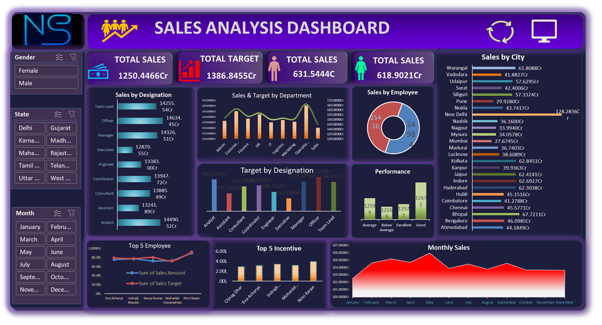

# Excel Sales Analysis Dashboard

# Objective
The objective of this project is to analyze sales data and build an interactive Excel dashboard to track sales performance, identify trends, and evaluate employee productivity.

# Project Overview
This project analyzes sales performance using Microsoft Excel and presents insights through an interactive dashboard. The dashboard helps in understanding sales trends, employee performance, and category-wise revenue distribution.

# Dataset
- Total Records: 50,000+
- Columns: 16
- Data includes employee information, sales amount, product category, and monthly sales data.

# Tools & Techniques Used
- Microsoft Excel
- Data Cleaning
- Pivot Tables
- Pivot Charts
- Interactive Dashboard Design

# Key Insights
- Monthly sales performance trends
- Top performing employees based on sales
- Category-wise sales comparison
- Overall sales distribution analysis
# Dashboard Preview

## Project Files
- sales analysis dashboard.xlsm – Contains raw data, pivot tables, and dashboard.
